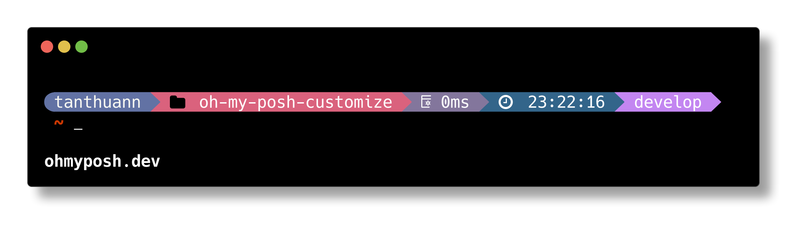

# Install
- Download font: **RobotoMono** [Oh My Posh | Fonts](https://ohmyposh.dev/docs/installation/fonts)
- Follow this [Oh My Posh | Customize](https://ohmyposh.dev/docs/installation/customize) and install with this script:

  ```
    oh-my-posh init pwsh --config 'https://raw.githubusercontent.com/tanthuann/oh-my-posh-customize/develop/.mytheme.omp.json' | Invoke-Expression
  ```
- Change $profile file with above code.


